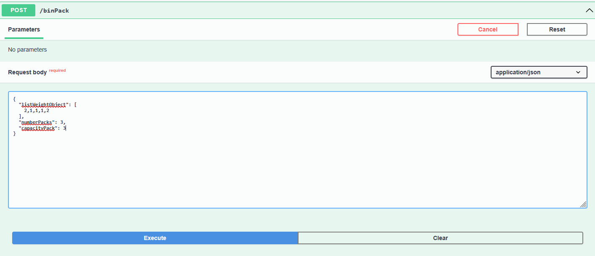
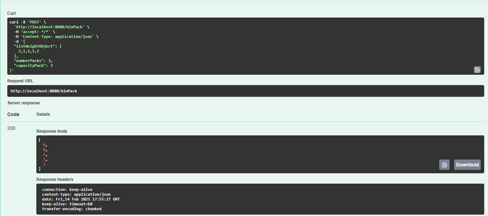

# BinPack

BinPack API REST project allows you to solve BinPack Problem giving configuration. This project is a refactoring university project.

# 👩‍💻 Technologies

| Back - Spring Boot | version (works) | 
| --- | --- |
| java | 22 |
| maven| 3.9.6 |

# ⚡️ Standard Execution

```bash
mvn spring-boot:run
```

URL of Swagger: http://localhost:8080/swagger-ui/index.html

# ☁️ Docker Execution

To create image Docker, execute this command

```bash
docker build -t binpack .  
```

To execute application, execute this command. 8080:8080 is port and default port, so change it if you execute application in another port.

```bash
docker run -p 8080:8080 binpack
```

# 👁️ Preview of project

### Swagger


### Exemple of result for request



<br>

| parameterName | value |
| --- | --- |
| list of object weight | [ 2 , 1 , 1 , 1 , 2 ] |
| number of packs | 3 |
| capacity for each pack | 3 |
<br>



<br>

| id Pack | objects | weight in pack | 
| --- | --- | --- |
| 0 | object0 - object1 | 3 |
| 1 | object2 - object3 | 2 |
| 2 | object3 | 2 |

<br>

# 🔭 Futur functionnalities 

- Resolve with different packs weight